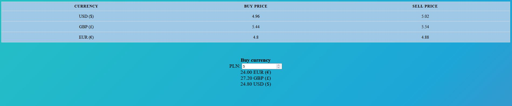

# Virtual cantor (Hacktoberfest task)
My web application written in .NET Core makes it easy and quick to solve the logic puzzles that are magic squares.

##### Languages used:
HTML, CSS, JavaScript

##### Description:
Virtual exchange office is a simple project of an online exchange office, where you can check the current exchange rates of this exchange office and check into which amount of a given currency you can exchange the entered amount of PLN currency.

##### Operation:
When the page loads, a dynamically generated table with currencies and their buying and selling rates is visible at the top. Lower down, you can enter the amount of PLN to see how much of the other currencies it can be exchanged for.

##### Screen

